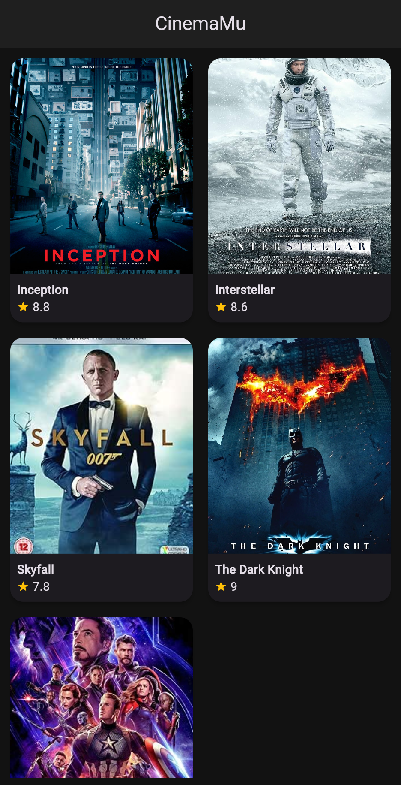
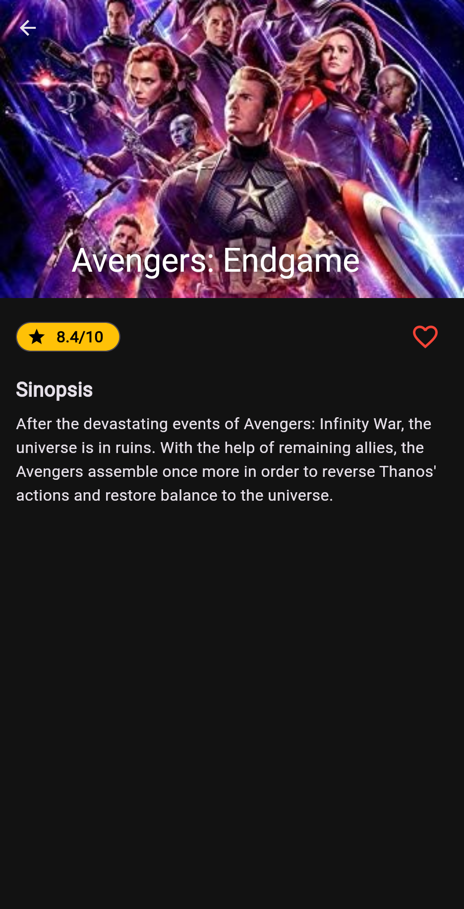

# CinemaMu - Movie Catalog App

## Deskripsi Aplikasi

CinemaMu merupakan aplikasi katalog film mobile yang menampilkan daftar film populer beserta sinopsis dan rating. Aplikasi ini dibuat untuk orang yang penasaran dengan sinopsis dan skor ulasan terhadap suatu film, terutama yang sedaing populer sekarang ini.

## Fitur Utama

1. **Home Screen Responsif:** Menampilkan grid poster film yang menyesuaikan ukuran layar (2 kolom di HP, 4 kolom di Tablet).
2. **Detail Movie:** Menampilkan sinopsis lengkap, rating visual yang terdiri dari bintang dan angka, beserta poster film.
3. **Offline First:** Menggunakan aset gambar lokal sehingga aplikasi berjalan lancar tanpa internet.

# Dokumentasi Slicing UI - CinemaMu

Berikut adalah panduan antarmuka (User Interface) dan fungsionalitas aplikasi yang telah saya buat:

## Tampilan Utama (Home Screen) & Detail

|                                   Tampilan Layar                                    | Keterangan & Fungsionalitas                                                                                                                                                                                                                                                                                                                                                                                |
| :---------------------------------------------------------------------------------: | :--------------------------------------------------------------------------------------------------------------------------------------------------------------------------------------------------------------------------------------------------------------------------------------------------------------------------------------------------------------------------------------------------------- |
|             **Home Screen**               | **1. Grid Layout Responsif** Halaman ini menampilkan daftar film dalam format Grid. Jika dibuka di HP, grid akan menampilkan 2 kolom. Jika di Tablet/PC, otomatis menjadi 4 kolom.  **2. Poster Film** Menampilkan poster visual dari setiap film untuk menarik perhatian pengguna.  **3. Interaksi** Pengguna dapat menekan salah satu kartu film untuk berpindah ke halaman Detail. |
| **Detail Screen (salah satu film)**   | **1. Informasi Lengkap** Menampilkan Judul Film, Rating (Bintang), dan Sinopsis lengkap film tersebut.  **2. Tombol Favorit** Terdapat ikon 'Love' di pojok kanan yang bisa diklik untuk menyimpan film ke favorit.  **3. Navigasi Kembali** Pengguna dapat menekan tombol back di HP atau panah di pojok kiri atas untuk kembali ke menu utama.                                      |

## Struktur Folder & Aset

- `lib/screens/`: Berisi kode UI untuk Home dan Detail.
- `lib/widgets/`: Berisi widget kartu film yang dapat digunakan ulang (reusable).
- `assets/images/`: Berisi file gambar poster film (akses offline).

## Cara Menjalankan (How to Run):

1. Clone repository ini.
2. Jalankan 'flutter pub get'.
3. Jalankan 'flutter run'.
